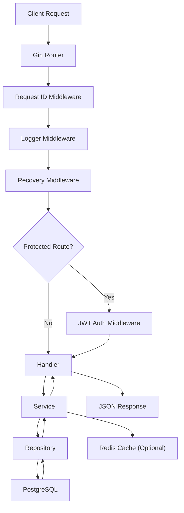
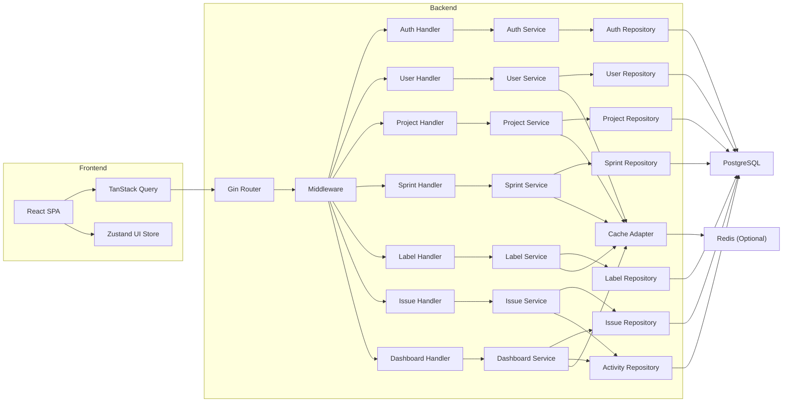
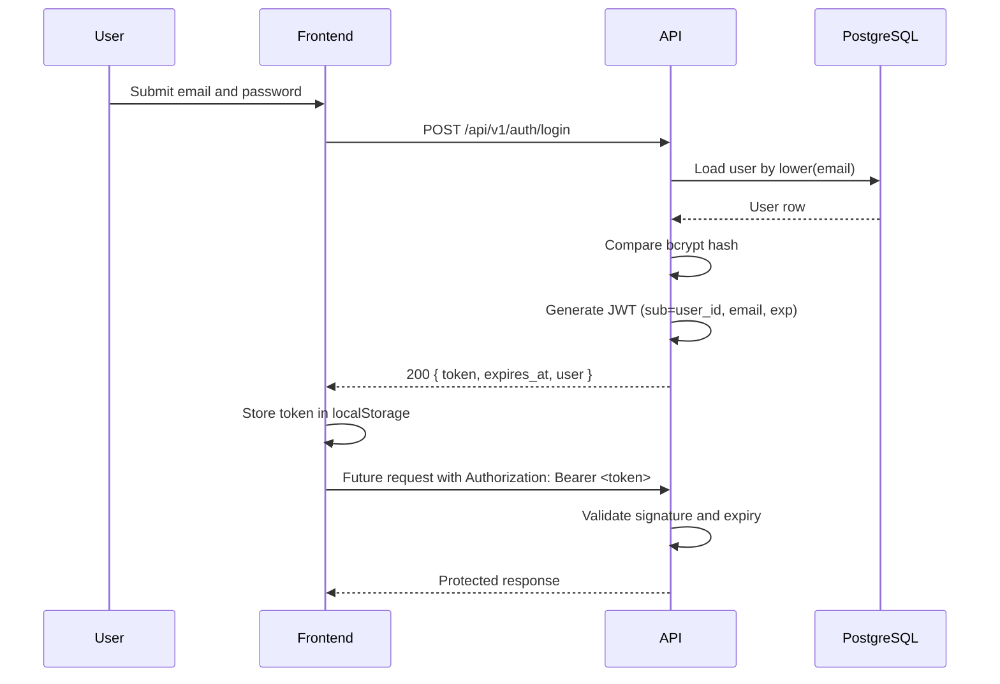
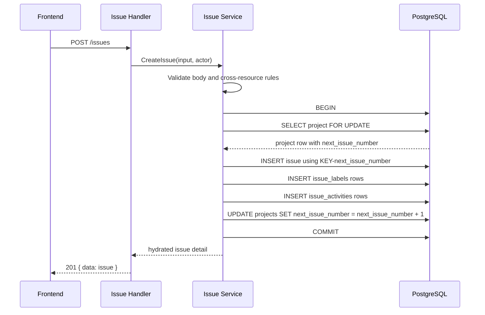
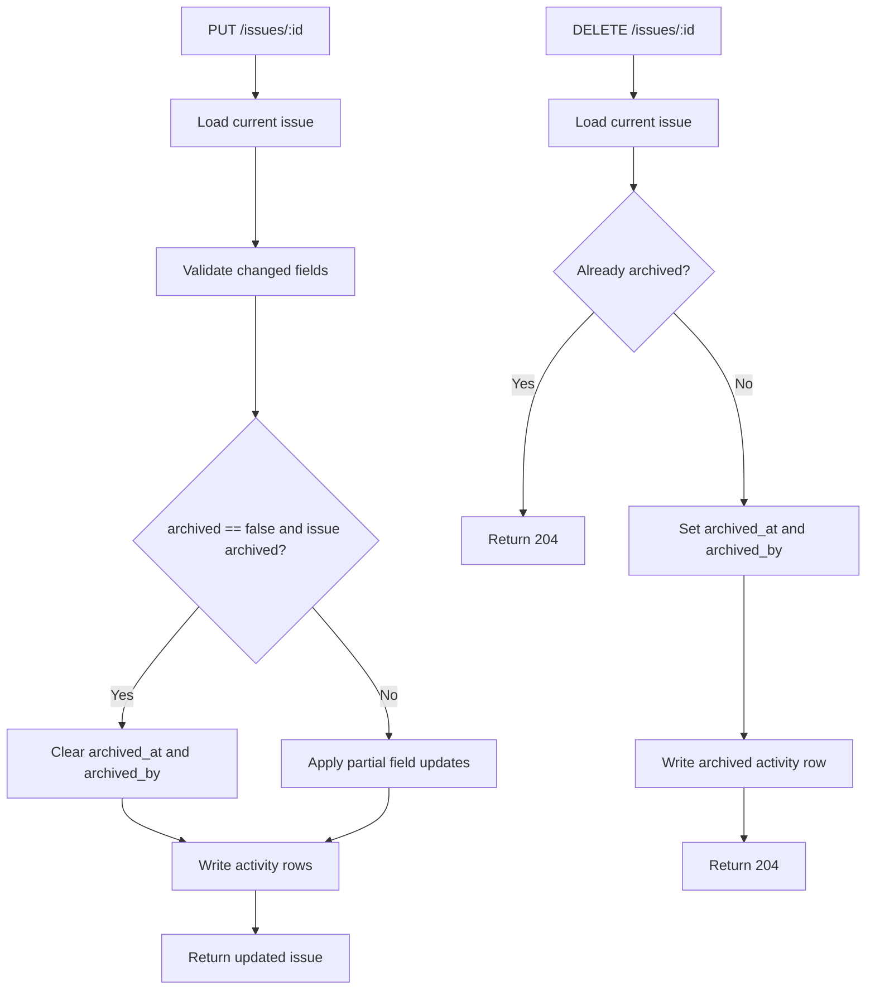
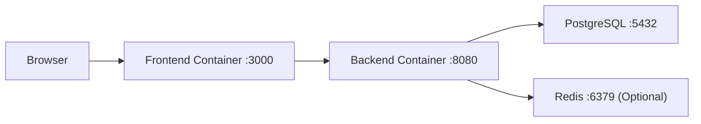

# Linear-lite

Ultra-Detailed Backend Technical Architecture Specification

Version: 2.0  
Status: Implementation Source of Truth  
Scope: MVP backend contract and supporting infrastructure

## 1. Document Purpose

This document is the single implementation reference for the Linear-lite backend. It replaces earlier draft architecture notes and supersedes all TODO-driven backend planning.

This specification is intentionally strict:

- 26 MVP endpoints only
- JWT Bearer authentication with access token only
- Go + Gin + PostgreSQL as the primary runtime path
- GORM-based repository layer with selective raw SQL
- Redis is optional and cache-only
- Sprints are project-scoped
- Issue deletion is archive-based and reversible through `PUT /issues/:id`
- Multi-workspace, comments, attachments, notifications, realtime updates, refresh tokens, cookie auth, and RBAC are out of scope

## 2. Product and Backend Decisions

### 2.1 Product assumptions carried into the backend

- Single tenant application for one team/workspace
- All authenticated users can perform all MVP actions
- Issues support list view and board view off the same source of truth
- Search must support exact issue identifier lookup and full-text search over issue title and description
- Dashboard counts exclude archived issues
- Team page is read-only in MVP from the frontend, but `/users` is still exposed for assignee and team data

### 2.2 Technology choices

| Layer | Choice | Notes |
| --- | --- | --- |
| API | Gin | HTTP routing, middleware, JSON APIs |
| Language | Go 1.21+ | Standard project runtime |
| Database | PostgreSQL 15+ | Primary transactional store |
| Data access | `GORM 1.25+` | Primary ORM for CRUD, associations, pagination, and transactions; raw SQL remains allowed for advanced PostgreSQL queries |
| Auth | JWT Bearer token | 24h access token only |
| Password hashing | bcrypt | Configurable cost via env |
| Caching | Redis 7+ | Optional, read-through cache only |
| Migrations | `golang-migrate` | SQL-only `up`/`down` migrations |
| Containers | Docker + Docker Compose | Local dev and deployable baseline |

## 3. Architecture Overview

### 3.1 Architectural style

Linear-lite uses a layered monolith:

`HTTP router -> middleware -> handlers -> services -> repositories -> PostgreSQL`

Responsibilities are fixed:

- Handlers parse HTTP requests, bind JSON/query params, and write HTTP responses.
- Services enforce validation, business rules, transactions, and activity logging.
- Repositories use GORM as the default persistence layer and fall back to raw SQL when PostgreSQL-specific behavior, locking, or query complexity makes ORM usage less clear or less safe.
- Cache adapters wrap selected read endpoints and are never required for correctness.

### 3.2 Layer responsibilities

| Layer | Responsibility | Must not do |
| --- | --- | --- |
| Router | Route registration and middleware order | Business logic |
| Middleware | Request ID, logging, CORS, auth, recovery | Database writes except logging sinks |
| Handlers | Parse params, call services, map service errors to HTTP | Raw SQL |
| Services | Validation, permission checks, transactions, side effects | HTTP formatting |
| Repositories | GORM CRUD, explicit association loading, scoped transactions, and selective raw SQL | Cross-resource business policy |
| Cache | Read caching and invalidation | Source-of-truth storage |

### 3.3 Canonical request lifecycle



### 3.4 Component interaction diagram



### 3.5 Authentication flow



### 3.6 Create issue flow



### 3.7 Update, archive, and restore flow



### 3.8 Docker deployment diagram



## 4. Project Structure

### 4.1 Frontend structure

```text
frontend/
  src/
    app/
      router/
      providers/
    components/
      common/
      issues/
      dashboard/
      projects/
      sprints/
      labels/
      team/
    pages/
      LoginPage.tsx
      RegisterPage.tsx
      DashboardPage.tsx
      IssuesListPage.tsx
      IssuesBoardPage.tsx
      IssueDetailPage.tsx
      ProjectsPage.tsx
      SprintsPage.tsx
      LabelsPage.tsx
      TeamPage.tsx
    features/
      auth/
      dashboard/
      issues/
      projects/
      sprints/
      labels/
      users/
    services/
      apiClient.ts
      authApi.ts
      issuesApi.ts
      projectsApi.ts
      sprintsApi.ts
      labelsApi.ts
      usersApi.ts
      dashboardApi.ts
    hooks/
    store/
    types/
    utils/
    App.tsx
```

### 4.2 Backend structure

```text
backend/
  cmd/
    api/
      main.go
  internal/
    config/
    middleware/
      request_id.go
      logger.go
      cors.go
      recovery.go
      auth.go
    handlers/
      auth_handler.go
      user_handler.go
      project_handler.go
      sprint_handler.go
      label_handler.go
      issue_handler.go
      dashboard_handler.go
    services/
      auth_service.go
      user_service.go
      project_service.go
      sprint_service.go
      label_service.go
      issue_service.go
      dashboard_service.go
    repositories/
      user_repository.go
      project_repository.go
      sprint_repository.go
      label_repository.go
      issue_repository.go
      activity_repository.go
    models/
      user.go
      project.go
      sprint.go
      label.go
      issue.go
      issue_label.go
      issue_activity.go
    cache/
    errors/
    validation/
  migrations/
    000001_extensions.up.sql
    000001_extensions.down.sql
    000002_functions.up.sql
    000002_functions.down.sql
    ...
```

## 5. Database Specification

### 5.1 Global database conventions

- All primary keys use `UUID`.
- PostgreSQL timezone handling uses `TIMESTAMPTZ`.
- All IDs are immutable. All foreign keys use `ON UPDATE RESTRICT`.
- The database is authoritative for structural integrity.
- Application code is authoritative for cross-row rules that require business context.
- GORM model structs may describe table mappings, associations, and field metadata, but they do not define the canonical schema.
- Migrations remain the only authoritative schema-management mechanism.
- Runtime schema mutation through GORM `AutoMigrate` is not allowed.
- `updated_at` is maintained by a shared trigger function.
- Search uses a stored `tsvector` column on `issues`.

### 5.2 Required extensions

```sql
CREATE EXTENSION IF NOT EXISTS pgcrypto;
```

No `citext` dependency is required because case-insensitive uniqueness is enforced with functional unique indexes on `LOWER(email)` and `LOWER(name)`.

### 5.3 Shared trigger for `updated_at`

```sql
CREATE OR REPLACE FUNCTION set_updated_at()
RETURNS TRIGGER AS $$
BEGIN
  NEW.updated_at = NOW();
  RETURN NEW;
END;
$$ LANGUAGE plpgsql;
```

Attach this trigger to `users`, `projects`, `sprints`, `labels`, and `issues`.

## 6. Table Definitions

### 6.1 Table: `users`

Purpose: Authentication and user profile data.

#### 6.1.1 Canonical DDL

```sql
CREATE TABLE users (
  id UUID PRIMARY KEY DEFAULT gen_random_uuid(),
  email VARCHAR(255) NOT NULL,
  password_hash VARCHAR(255) NOT NULL,
  name VARCHAR(255) NOT NULL,
  avatar_url TEXT NULL,
  created_at TIMESTAMPTZ NOT NULL DEFAULT NOW(),
  updated_at TIMESTAMPTZ NOT NULL DEFAULT NOW(),
  CONSTRAINT chk_users_email_not_blank CHECK (btrim(email) <> ''),
  CONSTRAINT chk_users_name_not_blank CHECK (btrim(name) <> ''),
  CONSTRAINT chk_users_name_len CHECK (char_length(name) BETWEEN 1 AND 255)
);
```

#### 6.1.2 Columns

| Column | Type | Null | Default | Constraints | Notes |
| --- | --- | --- | --- | --- | --- |
| `id` | `UUID` | No | `gen_random_uuid()` | PK | Immutable |
| `email` | `VARCHAR(255)` | No | None | Required, case-insensitive unique via index | Login identifier |
| `password_hash` | `VARCHAR(255)` | No | None | Required | bcrypt output |
| `name` | `VARCHAR(255)` | No | None | Required, 1-255 chars after trim | Display name |
| `avatar_url` | `TEXT` | Yes | `NULL` | Optional | Profile avatar |
| `created_at` | `TIMESTAMPTZ` | No | `NOW()` | Required | Creation timestamp |
| `updated_at` | `TIMESTAMPTZ` | No | `NOW()` | Trigger-maintained | Last update timestamp |

#### 6.1.3 Indexes

```sql
CREATE UNIQUE INDEX uq_users_lower_email ON users (LOWER(email));
```

#### 6.1.4 Validation rules

| Field | Rule |
| --- | --- |
| `email` | Required, max 255 chars, valid email syntax, compared case-insensitively |
| `password_hash` | Never accepted from client, always server-generated |
| `name` | Required, trimmed length 1-255 |
| `avatar_url` | Optional, max 2000 chars if provided |

#### 6.1.5 Trigger

```sql
CREATE TRIGGER trg_users_updated_at
BEFORE UPDATE ON users
FOR EACH ROW
EXECUTE FUNCTION set_updated_at();
```

### 6.2 Table: `projects`

Purpose: Groups issues and owns the issue identifier sequence.

#### 6.2.1 Canonical DDL

```sql
CREATE TABLE projects (
  id UUID PRIMARY KEY DEFAULT gen_random_uuid(),
  name VARCHAR(255) NOT NULL,
  description TEXT NULL,
  key VARCHAR(10) NOT NULL,
  next_issue_number INTEGER NOT NULL DEFAULT 1,
  created_by UUID NOT NULL,
  created_at TIMESTAMPTZ NOT NULL DEFAULT NOW(),
  updated_at TIMESTAMPTZ NOT NULL DEFAULT NOW(),
  CONSTRAINT chk_projects_name_not_blank CHECK (btrim(name) <> ''),
  CONSTRAINT chk_projects_name_len CHECK (char_length(name) BETWEEN 1 AND 255),
  CONSTRAINT chk_projects_key_format CHECK (key ~ '^[A-Z0-9]{2,10}$'),
  CONSTRAINT chk_projects_next_issue_number_positive CHECK (next_issue_number >= 1),
  CONSTRAINT fk_projects_created_by
    FOREIGN KEY (created_by)
    REFERENCES users(id)
    ON DELETE RESTRICT
    ON UPDATE RESTRICT
);
```

#### 6.2.2 Columns

| Column | Type | Null | Default | Constraints | Notes |
| --- | --- | --- | --- | --- | --- |
| `id` | `UUID` | No | `gen_random_uuid()` | PK | Immutable |
| `name` | `VARCHAR(255)` | No | None | Required | Project name |
| `description` | `TEXT` | Yes | `NULL` | Optional | Up to 10000 chars at app layer |
| `key` | `VARCHAR(10)` | No | None | Required, unique, `^[A-Z0-9]{2,10}$` | Public project code |
| `next_issue_number` | `INTEGER` | No | `1` | `>= 1` | Used for issue IDs |
| `created_by` | `UUID` | No | None | FK -> `users.id` | Creator |
| `created_at` | `TIMESTAMPTZ` | No | `NOW()` | Required | Creation timestamp |
| `updated_at` | `TIMESTAMPTZ` | No | `NOW()` | Trigger-maintained | Last update timestamp |

#### 6.2.3 Foreign keys

| Column | References | ON DELETE | ON UPDATE | Nullable |
| --- | --- | --- | --- | --- |
| `created_by` | `users(id)` | `RESTRICT` | `RESTRICT` | No |

#### 6.2.4 Indexes

```sql
CREATE UNIQUE INDEX uq_projects_key ON projects (key);
CREATE INDEX idx_projects_created_by ON projects (created_by);
```

#### 6.2.5 Validation and business rules

| Field | Rule |
| --- | --- |
| `name` | Required, trimmed length 1-255 |
| `description` | Optional, max 10000 chars |
| `key` | Required, uppercase alphanumeric, 2-10 chars, unique |
| `next_issue_number` | Internal only, never writable from client |

Business rules:

- `key` can be updated only if the project has zero issues.
- Project deletion is blocked if any issues or sprints reference the project.

#### 6.2.6 Trigger

```sql
CREATE TRIGGER trg_projects_updated_at
BEFORE UPDATE ON projects
FOR EACH ROW
EXECUTE FUNCTION set_updated_at();
```

### 6.3 Table: `sprints`

Purpose: Project-scoped iterations.

#### 6.3.1 Canonical DDL

```sql
CREATE TABLE sprints (
  id UUID PRIMARY KEY DEFAULT gen_random_uuid(),
  name VARCHAR(255) NOT NULL,
  description TEXT NULL,
  project_id UUID NOT NULL,
  start_date DATE NOT NULL,
  end_date DATE NOT NULL,
  status VARCHAR(20) NOT NULL DEFAULT 'planned',
  created_at TIMESTAMPTZ NOT NULL DEFAULT NOW(),
  updated_at TIMESTAMPTZ NOT NULL DEFAULT NOW(),
  CONSTRAINT chk_sprints_name_not_blank CHECK (btrim(name) <> ''),
  CONSTRAINT chk_sprints_name_len CHECK (char_length(name) BETWEEN 1 AND 255),
  CONSTRAINT chk_sprints_status CHECK (status IN ('planned', 'active', 'completed')),
  CONSTRAINT chk_sprints_date_range CHECK (end_date >= start_date),
  CONSTRAINT fk_sprints_project_id
    FOREIGN KEY (project_id)
    REFERENCES projects(id)
    ON DELETE RESTRICT
    ON UPDATE RESTRICT
);
```

#### 6.3.2 Columns

| Column | Type | Null | Default | Constraints | Notes |
| --- | --- | --- | --- | --- | --- |
| `id` | `UUID` | No | `gen_random_uuid()` | PK | Immutable |
| `name` | `VARCHAR(255)` | No | None | Required | Sprint name |
| `description` | `TEXT` | Yes | `NULL` | Optional | Sprint goal/details |
| `project_id` | `UUID` | No | None | FK -> `projects.id` | Project owner |
| `start_date` | `DATE` | No | None | Required | Inclusive |
| `end_date` | `DATE` | No | None | Required, `>= start_date` | Inclusive |
| `status` | `VARCHAR(20)` | No | `'planned'` | Enum | `planned`, `active`, `completed` |
| `created_at` | `TIMESTAMPTZ` | No | `NOW()` | Required | Creation timestamp |
| `updated_at` | `TIMESTAMPTZ` | No | `NOW()` | Trigger-maintained | Last update timestamp |

#### 6.3.3 Foreign keys

| Column | References | ON DELETE | ON UPDATE | Nullable |
| --- | --- | --- | --- | --- |
| `project_id` | `projects(id)` | `RESTRICT` | `RESTRICT` | No |

#### 6.3.4 Indexes

```sql
CREATE INDEX idx_sprints_project_id ON sprints (project_id);
CREATE INDEX idx_sprints_status ON sprints (status);
CREATE INDEX idx_sprints_project_dates ON sprints (project_id, start_date, end_date);
CREATE UNIQUE INDEX uq_sprints_one_active_per_project
  ON sprints (project_id)
  WHERE status = 'active';
```

#### 6.3.5 Validation and business rules

| Field | Rule |
| --- | --- |
| `name` | Required, trimmed length 1-255 |
| `description` | Optional, max 10000 chars |
| `project_id` | Required, must reference existing project |
| `start_date` | Required ISO date |
| `end_date` | Required ISO date, `>= start_date` |
| `status` | One of `planned`, `active`, `completed` |

Business rules:

- Sprints are always project-scoped.
- Only one sprint per project may be `active`.
- Date overlap between non-active sprints is allowed in MVP.
- Deleting a sprint is blocked if it is active or referenced by any issue.

#### 6.3.6 Trigger

```sql
CREATE TRIGGER trg_sprints_updated_at
BEFORE UPDATE ON sprints
FOR EACH ROW
EXECUTE FUNCTION set_updated_at();
```

### 6.4 Table: `labels`

Purpose: Reusable issue tags.

#### 6.4.1 Canonical DDL

```sql
CREATE TABLE labels (
  id UUID PRIMARY KEY DEFAULT gen_random_uuid(),
  name VARCHAR(50) NOT NULL,
  color VARCHAR(7) NOT NULL,
  description TEXT NULL,
  created_at TIMESTAMPTZ NOT NULL DEFAULT NOW(),
  updated_at TIMESTAMPTZ NOT NULL DEFAULT NOW(),
  CONSTRAINT chk_labels_name_not_blank CHECK (btrim(name) <> ''),
  CONSTRAINT chk_labels_name_len CHECK (char_length(name) BETWEEN 1 AND 50),
  CONSTRAINT chk_labels_color_hex CHECK (color ~ '^#[0-9A-Fa-f]{6}$')
);
```

#### 6.4.2 Columns

| Column | Type | Null | Default | Constraints | Notes |
| --- | --- | --- | --- | --- | --- |
| `id` | `UUID` | No | `gen_random_uuid()` | PK | Immutable |
| `name` | `VARCHAR(50)` | No | None | Required, unique via case-insensitive index | Label name |
| `color` | `VARCHAR(7)` | No | None | Required hex color | `#RRGGBB` |
| `description` | `TEXT` | Yes | `NULL` | Optional | Optional help text |
| `created_at` | `TIMESTAMPTZ` | No | `NOW()` | Required | Creation timestamp |
| `updated_at` | `TIMESTAMPTZ` | No | `NOW()` | Trigger-maintained | Last update timestamp |

#### 6.4.3 Indexes

```sql
CREATE UNIQUE INDEX uq_labels_lower_name ON labels (LOWER(name));
```

#### 6.4.4 Validation and business rules

| Field | Rule |
| --- | --- |
| `name` | Required, trimmed length 1-50, unique case-insensitively |
| `color` | Required, exact pattern `^#[0-9A-Fa-f]{6}$` |
| `description` | Optional, max 1000 chars |

Business rule:

- Deleting a label is blocked if any `issue_labels` row references it.

#### 6.4.5 Trigger

```sql
CREATE TRIGGER trg_labels_updated_at
BEFORE UPDATE ON labels
FOR EACH ROW
EXECUTE FUNCTION set_updated_at();
```

### 6.5 Table: `issues`

Purpose: Core work item record.

#### 6.5.1 Canonical DDL

```sql
CREATE TABLE issues (
  id UUID PRIMARY KEY DEFAULT gen_random_uuid(),
  identifier VARCHAR(32) NOT NULL,
  title VARCHAR(500) NOT NULL,
  description TEXT NULL,
  status VARCHAR(20) NOT NULL DEFAULT 'backlog',
  priority VARCHAR(10) NOT NULL DEFAULT 'medium',
  project_id UUID NOT NULL,
  sprint_id UUID NULL,
  assignee_id UUID NULL,
  created_by UUID NOT NULL,
  archived_at TIMESTAMPTZ NULL,
  archived_by UUID NULL,
  search_vector tsvector GENERATED ALWAYS AS (
    setweight(to_tsvector('english', coalesce(title, '')), 'A') ||
    setweight(to_tsvector('english', coalesce(description, '')), 'B')
  ) STORED,
  created_at TIMESTAMPTZ NOT NULL DEFAULT NOW(),
  updated_at TIMESTAMPTZ NOT NULL DEFAULT NOW(),
  CONSTRAINT chk_issues_title_not_blank CHECK (btrim(title) <> ''),
  CONSTRAINT chk_issues_title_len CHECK (char_length(title) BETWEEN 1 AND 500),
  CONSTRAINT chk_issues_status CHECK (
    status IN ('backlog', 'todo', 'in_progress', 'in_review', 'done', 'cancelled')
  ),
  CONSTRAINT chk_issues_priority CHECK (
    priority IN ('low', 'medium', 'high', 'urgent')
  ),
  CONSTRAINT chk_issues_identifier_not_blank CHECK (btrim(identifier) <> ''),
  CONSTRAINT chk_issues_archive_pair CHECK (
    (archived_at IS NULL AND archived_by IS NULL) OR
    (archived_at IS NOT NULL AND archived_by IS NOT NULL)
  ),
  CONSTRAINT fk_issues_project_id
    FOREIGN KEY (project_id)
    REFERENCES projects(id)
    ON DELETE RESTRICT
    ON UPDATE RESTRICT,
  CONSTRAINT fk_issues_sprint_id
    FOREIGN KEY (sprint_id)
    REFERENCES sprints(id)
    ON DELETE RESTRICT
    ON UPDATE RESTRICT,
  CONSTRAINT fk_issues_assignee_id
    FOREIGN KEY (assignee_id)
    REFERENCES users(id)
    ON DELETE SET NULL
    ON UPDATE RESTRICT,
  CONSTRAINT fk_issues_created_by
    FOREIGN KEY (created_by)
    REFERENCES users(id)
    ON DELETE RESTRICT
    ON UPDATE RESTRICT,
  CONSTRAINT fk_issues_archived_by
    FOREIGN KEY (archived_by)
    REFERENCES users(id)
    ON DELETE SET NULL
    ON UPDATE RESTRICT
);
```

#### 6.5.2 Columns

| Column | Type | Null | Default | Constraints | Notes |
| --- | --- | --- | --- | --- | --- |
| `id` | `UUID` | No | `gen_random_uuid()` | PK | Immutable |
| `identifier` | `VARCHAR(32)` | No | None | Required, unique | `KEY-123` style |
| `title` | `VARCHAR(500)` | No | None | Required | Issue title |
| `description` | `TEXT` | Yes | `NULL` | Optional | Markdown |
| `status` | `VARCHAR(20)` | No | `'backlog'` | Enum | Workflow state |
| `priority` | `VARCHAR(10)` | No | `'medium'` | Enum | Priority |
| `project_id` | `UUID` | No | None | FK -> `projects.id` | Required |
| `sprint_id` | `UUID` | Yes | `NULL` | FK -> `sprints.id` | Optional |
| `assignee_id` | `UUID` | Yes | `NULL` | FK -> `users.id` | Optional |
| `created_by` | `UUID` | No | None | FK -> `users.id` | Required |
| `archived_at` | `TIMESTAMPTZ` | Yes | `NULL` | Archive pair rule | Set by DELETE |
| `archived_by` | `UUID` | Yes | `NULL` | FK -> `users.id` | Set with `archived_at` |
| `search_vector` | `tsvector` | No | Generated | Search | Stored generated column |
| `created_at` | `TIMESTAMPTZ` | No | `NOW()` | Required | Creation timestamp |
| `updated_at` | `TIMESTAMPTZ` | No | `NOW()` | Trigger-maintained | Last update timestamp |

#### 6.5.3 Foreign keys

| Column | References | ON DELETE | ON UPDATE | Nullable |
| --- | --- | --- | --- | --- |
| `project_id` | `projects(id)` | `RESTRICT` | `RESTRICT` | No |
| `sprint_id` | `sprints(id)` | `RESTRICT` | `RESTRICT` | Yes |
| `assignee_id` | `users(id)` | `SET NULL` | `RESTRICT` | Yes |
| `created_by` | `users(id)` | `RESTRICT` | `RESTRICT` | No |
| `archived_by` | `users(id)` | `SET NULL` | `RESTRICT` | Yes |

#### 6.5.4 Indexes

```sql
CREATE UNIQUE INDEX uq_issues_identifier ON issues (identifier);
CREATE INDEX idx_issues_project_id ON issues (project_id);
CREATE INDEX idx_issues_sprint_id ON issues (sprint_id);
CREATE INDEX idx_issues_assignee_id ON issues (assignee_id);
CREATE INDEX idx_issues_created_by ON issues (created_by);
CREATE INDEX idx_issues_status ON issues (status);
CREATE INDEX idx_issues_priority ON issues (priority);
CREATE INDEX idx_issues_archived_at ON issues (archived_at);
CREATE INDEX idx_issues_project_status_updated_at
  ON issues (project_id, status, updated_at DESC);
CREATE INDEX idx_issues_assignee_status_updated_at
  ON issues (assignee_id, status, updated_at DESC);
CREATE INDEX idx_issues_search_vector ON issues USING GIN (search_vector);
```

#### 6.5.5 Validation and business rules

| Field | Rule |
| --- | --- |
| `identifier` | Internal only, generated as `{project.key}-{next_issue_number}` |
| `title` | Required, trimmed length 1-500 |
| `description` | Optional, max 50000 chars |
| `status` | One of `backlog`, `todo`, `in_progress`, `in_review`, `done`, `cancelled` |
| `priority` | One of `low`, `medium`, `high`, `urgent` |
| `project_id` | Required, existing project |
| `sprint_id` | Optional, existing sprint, and sprint must belong to same project |
| `assignee_id` | Optional, existing user |
| `created_by` | Internal only, derived from auth token |
| `archived_at` | Internal only |
| `archived_by` | Internal only |

Business rules:

- Archived issues are excluded from all collection queries unless `include_archived=true`.
- Dashboard queries always exclude archived issues.
- Status transitions are unrestricted in MVP.
- Concurrency is `last write wins`.
- `DELETE /issues/:id` archives the issue.
- `PUT /issues/:id` with `"archived": false` restores an archived issue.
- `PUT /issues/:id` with `"archived": true` is rejected with `400`; archiving must use `DELETE`.

#### 6.5.6 Trigger

```sql
CREATE TRIGGER trg_issues_updated_at
BEFORE UPDATE ON issues
FOR EACH ROW
EXECUTE FUNCTION set_updated_at();
```

### 6.6 Table: `issue_labels`

Purpose: Many-to-many join table between issues and labels.

#### 6.6.1 Canonical DDL

```sql
CREATE TABLE issue_labels (
  issue_id UUID NOT NULL,
  label_id UUID NOT NULL,
  created_at TIMESTAMPTZ NOT NULL DEFAULT NOW(),
  PRIMARY KEY (issue_id, label_id),
  CONSTRAINT fk_issue_labels_issue_id
    FOREIGN KEY (issue_id)
    REFERENCES issues(id)
    ON DELETE CASCADE
    ON UPDATE RESTRICT,
  CONSTRAINT fk_issue_labels_label_id
    FOREIGN KEY (label_id)
    REFERENCES labels(id)
    ON DELETE RESTRICT
    ON UPDATE RESTRICT
);
```

#### 6.6.2 Columns

| Column | Type | Null | Default | Constraints | Notes |
| --- | --- | --- | --- | --- | --- |
| `issue_id` | `UUID` | No | None | PK, FK -> `issues.id` | Required |
| `label_id` | `UUID` | No | None | PK, FK -> `labels.id` | Required |
| `created_at` | `TIMESTAMPTZ` | No | `NOW()` | Required | Link creation time |

#### 6.6.3 Foreign keys

| Column | References | ON DELETE | ON UPDATE | Nullable |
| --- | --- | --- | --- | --- |
| `issue_id` | `issues(id)` | `CASCADE` | `RESTRICT` | No |
| `label_id` | `labels(id)` | `RESTRICT` | `RESTRICT` | No |

#### 6.6.4 Indexes

```sql
CREATE INDEX idx_issue_labels_issue_id ON issue_labels (issue_id);
CREATE INDEX idx_issue_labels_label_id ON issue_labels (label_id);
```

#### 6.6.5 Validation and business rules

- Duplicate issue-label pairs are impossible because of the composite primary key.
- Labels cannot be deleted while referenced because of `ON DELETE RESTRICT`.

### 6.7 Table: `issue_activities`

Purpose: Immutable audit log for issue changes.

#### 6.7.1 Canonical DDL

```sql
CREATE TABLE issue_activities (
  id UUID PRIMARY KEY DEFAULT gen_random_uuid(),
  issue_id UUID NOT NULL,
  user_id UUID NOT NULL,
  action VARCHAR(50) NOT NULL,
  field_name VARCHAR(100) NULL,
  old_value TEXT NULL,
  new_value TEXT NULL,
  created_at TIMESTAMPTZ NOT NULL DEFAULT NOW(),
  CONSTRAINT chk_issue_activities_action CHECK (
    action IN (
      'created',
      'updated',
      'title_changed',
      'description_changed',
      'status_changed',
      'priority_changed',
      'assignee_changed',
      'sprint_changed',
      'project_changed',
      'label_added',
      'label_removed',
      'archived',
      'restored'
    )
  ),
  CONSTRAINT fk_issue_activities_issue_id
    FOREIGN KEY (issue_id)
    REFERENCES issues(id)
    ON DELETE CASCADE
    ON UPDATE RESTRICT,
  CONSTRAINT fk_issue_activities_user_id
    FOREIGN KEY (user_id)
    REFERENCES users(id)
    ON DELETE RESTRICT
    ON UPDATE RESTRICT
);
```

#### 6.7.2 Columns

| Column | Type | Null | Default | Constraints | Notes |
| --- | --- | --- | --- | --- | --- |
| `id` | `UUID` | No | `gen_random_uuid()` | PK | Immutable |
| `issue_id` | `UUID` | No | None | FK -> `issues.id` | Required |
| `user_id` | `UUID` | No | None | FK -> `users.id` | Required actor |
| `action` | `VARCHAR(50)` | No | None | Enum | Activity type |
| `field_name` | `VARCHAR(100)` | Yes | `NULL` | Optional | Changed field name |
| `old_value` | `TEXT` | Yes | `NULL` | Optional | Previous value |
| `new_value` | `TEXT` | Yes | `NULL` | Optional | New value |
| `created_at` | `TIMESTAMPTZ` | No | `NOW()` | Required | Event timestamp |

#### 6.7.3 Foreign keys

| Column | References | ON DELETE | ON UPDATE | Nullable |
| --- | --- | --- | --- | --- |
| `issue_id` | `issues(id)` | `CASCADE` | `RESTRICT` | No |
| `user_id` | `users(id)` | `RESTRICT` | `RESTRICT` | No |

#### 6.7.4 Indexes

```sql
CREATE INDEX idx_issue_activities_issue_id_created_at
  ON issue_activities (issue_id, created_at DESC);
CREATE INDEX idx_issue_activities_user_id_created_at
  ON issue_activities (user_id, created_at DESC);
```

#### 6.7.5 Validation and business rules

- Activity rows are append-only.
- Activity rows are created inside the same transaction as the triggering issue mutation.
- No partitioning is required in MVP.

## 7. Foreign Key Matrix

| From table | Column | To table | Required | ON DELETE | ON UPDATE |
| --- | --- | --- | --- | --- | --- |
| `projects` | `created_by` | `users.id` | Yes | `RESTRICT` | `RESTRICT` |
| `sprints` | `project_id` | `projects.id` | Yes | `RESTRICT` | `RESTRICT` |
| `issues` | `project_id` | `projects.id` | Yes | `RESTRICT` | `RESTRICT` |
| `issues` | `sprint_id` | `sprints.id` | No | `RESTRICT` | `RESTRICT` |
| `issues` | `assignee_id` | `users.id` | No | `SET NULL` | `RESTRICT` |
| `issues` | `created_by` | `users.id` | Yes | `RESTRICT` | `RESTRICT` |
| `issues` | `archived_by` | `users.id` | No | `SET NULL` | `RESTRICT` |
| `issue_labels` | `issue_id` | `issues.id` | Yes | `CASCADE` | `RESTRICT` |
| `issue_labels` | `label_id` | `labels.id` | Yes | `RESTRICT` | `RESTRICT` |
| `issue_activities` | `issue_id` | `issues.id` | Yes | `CASCADE` | `RESTRICT` |
| `issue_activities` | `user_id` | `users.id` | Yes | `RESTRICT` | `RESTRICT` |

## 8. Complete Index Strategy

| Table | Index name | Definition | Purpose |
| --- | --- | --- | --- |
| `users` | `uq_users_lower_email` | `UNIQUE (LOWER(email))` | Case-insensitive login and uniqueness |
| `projects` | `uq_projects_key` | `UNIQUE (key)` | Public project key uniqueness |
| `projects` | `idx_projects_created_by` | `(created_by)` | Filter by creator |
| `sprints` | `idx_sprints_project_id` | `(project_id)` | Project lookup |
| `sprints` | `idx_sprints_status` | `(status)` | Status filtering |
| `sprints` | `idx_sprints_project_dates` | `(project_id, start_date, end_date)` | Project date-range queries |
| `sprints` | `uq_sprints_one_active_per_project` | `UNIQUE (project_id) WHERE status='active'` | Single active sprint per project |
| `labels` | `uq_labels_lower_name` | `UNIQUE (LOWER(name))` | Case-insensitive uniqueness |
| `issues` | `uq_issues_identifier` | `UNIQUE (identifier)` | Direct issue lookup |
| `issues` | `idx_issues_project_id` | `(project_id)` | Filter by project |
| `issues` | `idx_issues_sprint_id` | `(sprint_id)` | Filter by sprint |
| `issues` | `idx_issues_assignee_id` | `(assignee_id)` | Filter by assignee |
| `issues` | `idx_issues_created_by` | `(created_by)` | Filter by creator |
| `issues` | `idx_issues_status` | `(status)` | Status filtering |
| `issues` | `idx_issues_priority` | `(priority)` | Priority filtering |
| `issues` | `idx_issues_archived_at` | `(archived_at)` | Archive filter |
| `issues` | `idx_issues_project_status_updated_at` | `(project_id, status, updated_at DESC)` | Board/list project views |
| `issues` | `idx_issues_assignee_status_updated_at` | `(assignee_id, status, updated_at DESC)` | My issues views |
| `issues` | `idx_issues_search_vector` | `GIN (search_vector)` | Full-text search |
| `issue_labels` | `idx_issue_labels_issue_id` | `(issue_id)` | Fetch labels by issue |
| `issue_labels` | `idx_issue_labels_label_id` | `(label_id)` | Fetch issues by label |
| `issue_activities` | `idx_issue_activities_issue_id_created_at` | `(issue_id, created_at DESC)` | Activity timeline |
| `issue_activities` | `idx_issue_activities_user_id_created_at` | `(user_id, created_at DESC)` | User activity queries |

## 9. Issue Identifier Generation

Issue identifiers are generated transactionally per project.

Algorithm:

1. Start transaction.
2. Open a GORM-managed transaction using `db.Transaction(...)`.
3. Lock the project row using raw SQL `SELECT id, key, next_issue_number FROM projects WHERE id = ? FOR UPDATE`.
4. Scan the locked row into the repository result.
5. Build identifier as `project.key + '-' + project.next_issue_number`.
6. Insert issue row through GORM or explicit SQL within the same transaction.
7. Insert any `issue_labels` rows.
8. Insert `issue_activities` row for creation plus label activities.
9. Increment `projects.next_issue_number`.
10. Commit transaction.

Rules:

- Gaps in numbering are acceptable if a transaction rolls back before commit.
- The identifier is immutable after creation.
- Project `key` changes are blocked once any issue exists to prevent semantic drift.

## 10. Validation Rules

### 10.1 Shared validation behavior

- All string inputs are trimmed before validation unless explicitly preserving whitespace is required.
- Empty strings for optional fields are normalized to `NULL` for `description`, `avatar_url`, `sprint_id`, and `assignee_id`.
- Unknown JSON fields are rejected with `400`.
- UUID fields must be valid UUID strings.
- Date fields must use `YYYY-MM-DD`.

### 10.2 Field-level validation matrix

| Resource | Field | Validation |
| --- | --- | --- |
| Auth | `email` | required, valid email, <=255 chars |
| Auth | `password` | required, min 8 chars, max 72 chars |
| User | `name` | required, trimmed length 1-255 |
| User | `avatar_url` | optional, valid URL if provided, <=2000 chars |
| Project | `name` | required, trimmed length 1-255 |
| Project | `description` | optional, <=10000 chars |
| Project | `key` | required, `^[A-Z0-9]{2,10}$`, unique |
| Sprint | `name` | required, trimmed length 1-255 |
| Sprint | `description` | optional, <=10000 chars |
| Sprint | `project_id` | required, existing project |
| Sprint | `start_date` | required ISO date |
| Sprint | `end_date` | required ISO date, `>= start_date` |
| Sprint | `status` | optional on create, enum if provided |
| Label | `name` | required, trimmed length 1-50, unique case-insensitive |
| Label | `color` | required, exact hex `#RRGGBB` |
| Label | `description` | optional, <=1000 chars |
| Issue | `title` | required on create, trimmed length 1-500 |
| Issue | `description` | optional, <=50000 chars |
| Issue | `status` | optional on create, enum if provided |
| Issue | `priority` | optional on create, enum if provided |
| Issue | `project_id` | required on create, existing project |
| Issue | `sprint_id` | optional, existing sprint, same project as issue |
| Issue | `assignee_id` | optional, existing user |
| Issue | `label_ids` | optional array, distinct UUIDs, all labels must exist |
| Issue | `archived` | optional on update only, only `false` allowed, meaning restore |

## 11. API Conventions

### 11.1 Base URL

`/api/v1`

### 11.2 Authentication

Public endpoints:

- `POST /auth/register`
- `POST /auth/login`

Protected endpoints:

- All other endpoints

Bearer format:

`Authorization: Bearer <token>`

JWT claims:

| Claim | Value |
| --- | --- |
| `sub` | user UUID |
| `email` | user email |
| `exp` | token expiry timestamp |
| `iat` | issued-at timestamp |

Token TTL:

- Default `24h`

### 11.3 Response envelopes

Single resource:

```json
{
  "data": {}
}
```

Collection:

```json
{
  "items": [],
  "pagination": {
    "page": 1,
    "limit": 50,
    "total": 0,
    "total_pages": 0
  }
}
```

Error:

```json
{
  "error": {
    "code": "validation_error",
    "message": "One or more fields are invalid.",
    "fields": {
      "email": "must be a valid email address"
    },
    "request_id": "01HXYZ..."
  }
}
```

### 11.4 Error code catalog

| HTTP | Code | Meaning |
| --- | --- | --- |
| `400` | `validation_error` | Body/query/path validation failed |
| `401` | `unauthorized` | Missing, invalid, or expired token |
| `404` | `not_found` | Resource does not exist |
| `409` | `conflict` | Unique conflict or blocked business rule |
| `500` | `internal_error` | Unexpected server error |

### 11.5 Pagination and sorting

- Default `page=1`
- Default `limit=50`
- Maximum `limit=100`
- Sort order values: `asc`, `desc`
- Unsupported `sort_by` values return `400`
- Repository list queries should default to GORM query builders for standard filtering and pagination.
- Use explicit `Preload` only for relationships required by the response contract.

### 11.6 Search behavior

- If `search` exactly matches an issue identifier pattern and a matching issue exists, that issue is returned at the top of results.
- Otherwise, the repository uses raw SQL with PostgreSQL full-text search over `issues.title` and `issues.description`.

### 11.7 Persistence strategy

- GORM is the default repository implementation mechanism.
- Use GORM for CRUD operations, pagination, transactions, and controlled association loading.
- Use raw SQL from the repository layer for:
  - `SELECT ... FOR UPDATE` issue identifier generation
  - PostgreSQL full-text search
  - dashboard aggregation queries
  - partial-index-sensitive sprint queries
  - any bulk association synchronization where hand-written SQL is clearer than generated ORM queries
- Raw SQL must not appear in handlers.
- Raw SQL should normally stay out of services unless a repository transaction wrapper requires it indirectly.
- Every raw SQL repository method should include a short inline comment explaining why ORM usage was not selected.

### 11.8 Concurrency

- All resource updates use `last write wins`.
- No optimistic locking column.
- No `ETag` support.

## 12. Canonical Resource Schemas

### 12.1 User schemas

#### `UserSummary`

| Field | Type |
| --- | --- |
| `id` | `string(uuid)` |
| `email` | `string` |
| `name` | `string` |
| `avatar_url` | `string|null` |
| `created_at` | `string(date-time)` |
| `updated_at` | `string(date-time)` |

#### `UserDetail`

`UserSummary` plus:

| Field | Type |
| --- | --- |
| `stats.total_created` | `integer` |
| `stats.total_assigned` | `integer` |
| `stats.in_progress_assigned` | `integer` |
| `stats.done_assigned` | `integer` |

### 12.2 Project schemas

#### `ProjectSummary`

| Field | Type |
| --- | --- |
| `id` | `string(uuid)` |
| `name` | `string` |
| `description` | `string|null` |
| `key` | `string` |
| `created_by` | `string(uuid)` |
| `created_at` | `string(date-time)` |
| `updated_at` | `string(date-time)` |
| `issue_counts.total` | `integer` |
| `issue_counts.backlog` | `integer` |
| `issue_counts.todo` | `integer` |
| `issue_counts.in_progress` | `integer` |
| `issue_counts.in_review` | `integer` |
| `issue_counts.done` | `integer` |
| `issue_counts.cancelled` | `integer` |
| `active_sprint` | `SprintSummary|null` |

#### `ProjectDetail`

`ProjectSummary` plus:

| Field | Type |
| --- | --- |
| `creator` | `UserSummary` |
| `sprints` | `SprintSummary[]` |

### 12.3 Sprint schemas

#### `SprintSummary`

| Field | Type |
| --- | --- |
| `id` | `string(uuid)` |
| `name` | `string` |
| `description` | `string|null` |
| `project_id` | `string(uuid)` |
| `start_date` | `string(date)` |
| `end_date` | `string(date)` |
| `status` | `string` |
| `created_at` | `string(date-time)` |
| `updated_at` | `string(date-time)` |
| `issue_counts.total` | `integer` |
| `issue_counts.backlog` | `integer` |
| `issue_counts.todo` | `integer` |
| `issue_counts.in_progress` | `integer` |
| `issue_counts.in_review` | `integer` |
| `issue_counts.done` | `integer` |
| `issue_counts.cancelled` | `integer` |

#### `SprintDetail`

`SprintSummary` plus:

| Field | Type |
| --- | --- |
| `project` | `ProjectSummary` |

### 12.4 Label schemas

#### `Label`

| Field | Type |
| --- | --- |
| `id` | `string(uuid)` |
| `name` | `string` |
| `color` | `string` |
| `description` | `string|null` |
| `created_at` | `string(date-time)` |
| `updated_at` | `string(date-time)` |

#### `LabelDetail`

`Label` plus:

| Field | Type |
| --- | --- |
| `usage_count` | `integer` |

### 12.5 Activity schema

#### `IssueActivity`

| Field | Type |
| --- | --- |
| `id` | `string(uuid)` |
| `issue_id` | `string(uuid)` |
| `user_id` | `string(uuid)` |
| `action` | `string` |
| `field_name` | `string|null` |
| `old_value` | `string|null` |
| `new_value` | `string|null` |
| `created_at` | `string(date-time)` |
| `user` | `UserSummary` |

### 12.6 Issue schemas

#### `IssueSummary`

| Field | Type |
| --- | --- |
| `id` | `string(uuid)` |
| `identifier` | `string` |
| `title` | `string` |
| `description` | `string|null` |
| `status` | `string` |
| `priority` | `string` |
| `project_id` | `string(uuid)` |
| `sprint_id` | `string(uuid)|null` |
| `assignee_id` | `string(uuid)|null` |
| `created_by` | `string(uuid)` |
| `archived_at` | `string(date-time)|null` |
| `archived_by` | `string(uuid)|null` |
| `created_at` | `string(date-time)` |
| `updated_at` | `string(date-time)` |
| `project` | `ProjectSummary` |
| `sprint` | `SprintSummary|null` |
| `assignee` | `UserSummary|null` |
| `creator` | `UserSummary` |
| `labels` | `Label[]` |

#### `IssueDetail`

`IssueSummary` plus:

| Field | Type |
| --- | --- |
| `activities` | `IssueActivity[]` |

### 12.7 Dashboard schema

#### `DashboardStats`

| Field | Type |
| --- | --- |
| `total_issues` | `integer` |
| `my_issues` | `integer` |
| `in_progress` | `integer` |
| `done_this_week` | `integer` |
| `active_sprint` | `SprintSummary|null` |
| `recent_activity` | `IssueActivity[]` |

## 13. API Endpoint Reference

## 13.1 Authentication Endpoints

### POST `/auth/register`

Purpose: Create a new user account and return an access token.

Auth required: No

Path params: None  
Query params: None

Request body:

| Field | Type | Required | Validation |
| --- | --- | --- | --- |
| `name` | `string` | Yes | 1-255 chars after trim |
| `email` | `string` | Yes | valid email, <=255, unique |
| `password` | `string` | Yes | min 8, max 72 |

Success:

- Status: `201`
- Response schema: `{ data: { token, expires_at, user } }`

Success example:

```json
{
  "data": {
    "token": "eyJhbGciOiJIUzI1NiIsInR5cCI6IkpXVCJ9...",
    "expires_at": "2026-04-02T09:30:00Z",
    "user": {
      "id": "0d378ee8-4d6b-4b1b-9a25-64fe4f7b9f00",
      "email": "alex@example.com",
      "name": "Alex Doe",
      "avatar_url": null,
      "created_at": "2026-04-01T09:30:00Z",
      "updated_at": "2026-04-01T09:30:00Z"
    }
  }
}
```

Errors:

- `400 validation_error` for invalid fields
- `409 conflict` if email already exists
- `500 internal_error`

Side effects:

- Inserts `users` row
- Hashes password with bcrypt
- Issues JWT

### POST `/auth/login`

Purpose: Authenticate an existing user and return an access token.

Auth required: No

Path params: None  
Query params: None

Request body:

| Field | Type | Required | Validation |
| --- | --- | --- | --- |
| `email` | `string` | Yes | valid email, <=255 |
| `password` | `string` | Yes | min 8, max 72 |

Success:

- Status: `200`
- Response schema: `{ data: { token, expires_at, user } }`

Success example:

```json
{
  "data": {
    "token": "eyJhbGciOiJIUzI1NiIsInR5cCI6IkpXVCJ9...",
    "expires_at": "2026-04-02T09:45:00Z",
    "user": {
      "id": "0d378ee8-4d6b-4b1b-9a25-64fe4f7b9f00",
      "email": "alex@example.com",
      "name": "Alex Doe",
      "avatar_url": null,
      "created_at": "2026-04-01T09:30:00Z",
      "updated_at": "2026-04-01T09:30:00Z"
    }
  }
}
```

Errors:

- `400 validation_error`
- `401 unauthorized` for bad credentials
- `500 internal_error`

Side effects:

- Issues JWT

### GET `/auth/me`

Purpose: Return the currently authenticated user profile.

Auth required: Yes

Path params: None  
Query params: None

Request body: None

Success:

- Status: `200`
- Response schema: `{ data: UserSummary }`

Success example:

```json
{
  "data": {
    "id": "0d378ee8-4d6b-4b1b-9a25-64fe4f7b9f00",
    "email": "alex@example.com",
    "name": "Alex Doe",
    "avatar_url": null,
    "created_at": "2026-04-01T09:30:00Z",
    "updated_at": "2026-04-01T09:30:00Z"
  }
}
```

Errors:

- `401 unauthorized`
- `500 internal_error`

Side effects: None

## 13.2 User Endpoints

### GET `/users`

Purpose: List team members for assignee selectors and team page.

Auth required: Yes

Path params: None

Query params:

| Name | Type | Required | Default | Notes |
| --- | --- | --- | --- | --- |
| `page` | `integer` | No | `1` | 1-based |
| `limit` | `integer` | No | `50` | max 100 |
| `search` | `string` | No | none | name/email substring search |
| `sort_by` | `string` | No | `name` | `name`, `created_at` |
| `sort_order` | `string` | No | `asc` | `asc`, `desc` |

Request body: None

Success:

- Status: `200`
- Response schema: collection of `UserSummary`

Success example:

```json
{
  "items": [
    {
      "id": "0d378ee8-4d6b-4b1b-9a25-64fe4f7b9f00",
      "email": "alex@example.com",
      "name": "Alex Doe",
      "avatar_url": null,
      "created_at": "2026-04-01T09:30:00Z",
      "updated_at": "2026-04-01T09:30:00Z"
    }
  ],
  "pagination": {
    "page": 1,
    "limit": 50,
    "total": 1,
    "total_pages": 1
  }
}
```

Errors:

- `400 validation_error`
- `401 unauthorized`
- `500 internal_error`

Side effects: None

### GET `/users/:id`

Purpose: Return a user profile with issue statistics.

Auth required: Yes

Path params:

| Name | Type | Required |
| --- | --- | --- |
| `id` | `uuid` | Yes |

Query params: None  
Request body: None

Success:

- Status: `200`
- Response schema: `{ data: UserDetail }`

Success example:

```json
{
  "data": {
    "id": "0d378ee8-4d6b-4b1b-9a25-64fe4f7b9f00",
    "email": "alex@example.com",
    "name": "Alex Doe",
    "avatar_url": null,
    "created_at": "2026-04-01T09:30:00Z",
    "updated_at": "2026-04-01T09:30:00Z",
    "stats": {
      "total_created": 12,
      "total_assigned": 5,
      "in_progress_assigned": 2,
      "done_assigned": 1
    }
  }
}
```

Errors:

- `400 validation_error`
- `401 unauthorized`
- `404 not_found`
- `500 internal_error`

Side effects: None

## 13.3 Project Endpoints

### GET `/projects`

Purpose: List projects with issue counts and active sprint summary.

Auth required: Yes

Query params:

| Name | Type | Required | Default | Notes |
| --- | --- | --- | --- | --- |
| `page` | `integer` | No | `1` | 1-based |
| `limit` | `integer` | No | `50` | max 100 |
| `search` | `string` | No | none | name/key substring |
| `sort_by` | `string` | No | `name` | `name`, `created_at`, `updated_at` |
| `sort_order` | `string` | No | `asc` | `asc`, `desc` |

Success:

- Status: `200`
- Response schema: collection of `ProjectSummary`

Success example:

```json
{
  "items": [
    {
      "id": "d4ff7e2a-f2a4-4a0f-981a-7d932cf8ef39",
      "name": "Platform",
      "description": "Core platform work",
      "key": "PLAT",
      "created_by": "0d378ee8-4d6b-4b1b-9a25-64fe4f7b9f00",
      "created_at": "2026-04-01T10:00:00Z",
      "updated_at": "2026-04-01T10:00:00Z",
      "issue_counts": {
        "total": 14,
        "backlog": 4,
        "todo": 3,
        "in_progress": 2,
        "in_review": 1,
        "done": 4,
        "cancelled": 0
      },
      "active_sprint": null
    }
  ],
  "pagination": {
    "page": 1,
    "limit": 50,
    "total": 1,
    "total_pages": 1
  }
}
```

Errors:

- `400 validation_error`
- `401 unauthorized`
- `500 internal_error`

Side effects: Cache read/write

### POST `/projects`

Purpose: Create a project.

Auth required: Yes

Request body:

| Field | Type | Required | Validation |
| --- | --- | --- | --- |
| `name` | `string` | Yes | 1-255 |
| `description` | `string|null` | No | <=10000 |
| `key` | `string` | Yes | `^[A-Z0-9]{2,10}$`, unique |

Success:

- Status: `201`
- Response schema: `{ data: ProjectDetail }`

Success example:

```json
{
  "data": {
    "id": "d4ff7e2a-f2a4-4a0f-981a-7d932cf8ef39",
    "name": "Platform",
    "description": "Core platform work",
    "key": "PLAT",
    "created_by": "0d378ee8-4d6b-4b1b-9a25-64fe4f7b9f00",
    "created_at": "2026-04-01T10:00:00Z",
    "updated_at": "2026-04-01T10:00:00Z",
    "issue_counts": {
      "total": 0,
      "backlog": 0,
      "todo": 0,
      "in_progress": 0,
      "in_review": 0,
      "done": 0,
      "cancelled": 0
    },
    "active_sprint": null,
    "creator": {
      "id": "0d378ee8-4d6b-4b1b-9a25-64fe4f7b9f00",
      "email": "alex@example.com",
      "name": "Alex Doe",
      "avatar_url": null,
      "created_at": "2026-04-01T09:30:00Z",
      "updated_at": "2026-04-01T09:30:00Z"
    },
    "sprints": []
  }
}
```

Errors:

- `400 validation_error`
- `401 unauthorized`
- `409 conflict` if key already exists
- `500 internal_error`

Side effects:

- Inserts project row
- Initializes `next_issue_number=1`
- Invalidates project cache

### GET `/projects/:id`

Purpose: Get a single project with creator, sprint list, and issue counts.

Auth required: Yes

Path params:

| Name | Type | Required |
| --- | --- | --- |
| `id` | `uuid` | Yes |

Success:

- Status: `200`
- Response schema: `{ data: ProjectDetail }`

Success example:

```json
{
  "data": {
    "id": "d4ff7e2a-f2a4-4a0f-981a-7d932cf8ef39",
    "name": "Platform",
    "description": "Core platform work",
    "key": "PLAT",
    "created_by": "0d378ee8-4d6b-4b1b-9a25-64fe4f7b9f00",
    "created_at": "2026-04-01T10:00:00Z",
    "updated_at": "2026-04-01T10:00:00Z",
    "issue_counts": {
      "total": 14,
      "backlog": 4,
      "todo": 3,
      "in_progress": 2,
      "in_review": 1,
      "done": 4,
      "cancelled": 0
    },
    "active_sprint": null,
    "creator": {
      "id": "0d378ee8-4d6b-4b1b-9a25-64fe4f7b9f00",
      "email": "alex@example.com",
      "name": "Alex Doe",
      "avatar_url": null,
      "created_at": "2026-04-01T09:30:00Z",
      "updated_at": "2026-04-01T09:30:00Z"
    },
    "sprints": []
  }
}
```

Errors:

- `400 validation_error`
- `401 unauthorized`
- `404 not_found`
- `500 internal_error`

Side effects: Cache read/write

### PUT `/projects/:id`

Purpose: Update project metadata.

Auth required: Yes

Path params:

| Name | Type | Required |
| --- | --- | --- |
| `id` | `uuid` | Yes |

Request body:

| Field | Type | Required | Validation |
| --- | --- | --- | --- |
| `name` | `string` | No | 1-255 |
| `description` | `string|null` | No | <=10000 |
| `key` | `string` | No | `^[A-Z0-9]{2,10}$`, unique if changed |

Success:

- Status: `200`
- Response schema: `{ data: ProjectDetail }`

Success example:

```json
{
  "data": {
    "id": "d4ff7e2a-f2a4-4a0f-981a-7d932cf8ef39",
    "name": "Platform Core",
    "description": "Core platform work and auth",
    "key": "PLAT",
    "created_by": "0d378ee8-4d6b-4b1b-9a25-64fe4f7b9f00",
    "created_at": "2026-04-01T10:00:00Z",
    "updated_at": "2026-04-01T12:00:00Z",
    "issue_counts": {
      "total": 14,
      "backlog": 4,
      "todo": 3,
      "in_progress": 2,
      "in_review": 1,
      "done": 4,
      "cancelled": 0
    },
    "active_sprint": null,
    "creator": {
      "id": "0d378ee8-4d6b-4b1b-9a25-64fe4f7b9f00",
      "email": "alex@example.com",
      "name": "Alex Doe",
      "avatar_url": null,
      "created_at": "2026-04-01T09:30:00Z",
      "updated_at": "2026-04-01T09:30:00Z"
    },
    "sprints": []
  }
}
```

Errors:

- `400 validation_error`
- `401 unauthorized`
- `404 not_found`
- `409 conflict` if key exists or project already has issues and key change requested
- `500 internal_error`

Side effects:

- Updates project row
- Invalidates project and issue cache

### DELETE `/projects/:id`

Purpose: Delete a project with no dependent issues or sprints.

Auth required: Yes

Path params:

| Name | Type | Required |
| --- | --- | --- |
| `id` | `uuid` | Yes |

Success:

- Status: `204`
- Response body: none

Success example:

```http
HTTP/1.1 204 No Content
```

Errors:

- `400 validation_error`
- `401 unauthorized`
- `404 not_found`
- `409 conflict` if any sprint or issue exists for the project
- `500 internal_error`

Side effects:

- Deletes project row
- Invalidates project and sprint cache

## 13.4 Sprint Endpoints

### GET `/sprints`

Purpose: List sprints with issue counts.

Auth required: Yes

Query params:

| Name | Type | Required | Default | Notes |
| --- | --- | --- | --- | --- |
| `page` | `integer` | No | `1` | 1-based |
| `limit` | `integer` | No | `50` | max 100 |
| `project_id` | `uuid` | No | none | filter |
| `status` | `string` | No | none | `planned`, `active`, `completed` |
| `search` | `string` | No | none | name substring |
| `sort_by` | `string` | No | `start_date` | `name`, `start_date`, `end_date`, `created_at` |
| `sort_order` | `string` | No | `desc` | `asc`, `desc` |

Success:

- Status: `200`
- Response schema: collection of `SprintSummary`

Success example:

```json
{
  "items": [
    {
      "id": "2ac1d6ca-778f-41ad-9f21-437e94ebc832",
      "name": "Sprint 1",
      "description": "Initial MVP sprint",
      "project_id": "d4ff7e2a-f2a4-4a0f-981a-7d932cf8ef39",
      "start_date": "2026-04-01",
      "end_date": "2026-04-14",
      "status": "planned",
      "created_at": "2026-04-01T10:15:00Z",
      "updated_at": "2026-04-01T10:15:00Z",
      "issue_counts": {
        "total": 3,
        "backlog": 1,
        "todo": 1,
        "in_progress": 1,
        "in_review": 0,
        "done": 0,
        "cancelled": 0
      }
    }
  ],
  "pagination": {
    "page": 1,
    "limit": 50,
    "total": 1,
    "total_pages": 1
  }
}
```

Errors:

- `400 validation_error`
- `401 unauthorized`
- `500 internal_error`

Side effects: Cache read/write

### POST `/sprints`

Purpose: Create a sprint.

Auth required: Yes

Request body:

| Field | Type | Required | Validation |
| --- | --- | --- | --- |
| `name` | `string` | Yes | 1-255 |
| `description` | `string|null` | No | <=10000 |
| `project_id` | `uuid` | Yes | existing project |
| `start_date` | `string(date)` | Yes | ISO date |
| `end_date` | `string(date)` | Yes | `>= start_date` |
| `status` | `string` | No | enum |

Success:

- Status: `201`
- Response schema: `{ data: SprintDetail }`

Success example:

```json
{
  "data": {
    "id": "2ac1d6ca-778f-41ad-9f21-437e94ebc832",
    "name": "Sprint 1",
    "description": "Initial MVP sprint",
    "project_id": "d4ff7e2a-f2a4-4a0f-981a-7d932cf8ef39",
    "start_date": "2026-04-01",
    "end_date": "2026-04-14",
    "status": "planned",
    "created_at": "2026-04-01T10:15:00Z",
    "updated_at": "2026-04-01T10:15:00Z",
    "issue_counts": {
      "total": 0,
      "backlog": 0,
      "todo": 0,
      "in_progress": 0,
      "in_review": 0,
      "done": 0,
      "cancelled": 0
    },
    "project": {
      "id": "d4ff7e2a-f2a4-4a0f-981a-7d932cf8ef39",
      "name": "Platform",
      "description": "Core platform work",
      "key": "PLAT",
      "created_by": "0d378ee8-4d6b-4b1b-9a25-64fe4f7b9f00",
      "created_at": "2026-04-01T10:00:00Z",
      "updated_at": "2026-04-01T10:00:00Z",
      "issue_counts": {
        "total": 0,
        "backlog": 0,
        "todo": 0,
        "in_progress": 0,
        "in_review": 0,
        "done": 0,
        "cancelled": 0
      },
      "active_sprint": null
    }
  }
}
```

Errors:

- `400 validation_error`
- `401 unauthorized`
- `404 not_found` if project missing
- `409 conflict` if creating another active sprint for same project
- `500 internal_error`

Side effects:

- Inserts sprint row
- Invalidates sprint, project, dashboard cache

### GET `/sprints/:id`

Purpose: Get sprint details with issue counts and parent project.

Auth required: Yes

Path params:

| Name | Type | Required |
| --- | --- | --- |
| `id` | `uuid` | Yes |

Success:

- Status: `200`
- Response schema: `{ data: SprintDetail }`

Success example:

```json
{
  "data": {
    "id": "2ac1d6ca-778f-41ad-9f21-437e94ebc832",
    "name": "Sprint 1",
    "description": "Initial MVP sprint",
    "project_id": "d4ff7e2a-f2a4-4a0f-981a-7d932cf8ef39",
    "start_date": "2026-04-01",
    "end_date": "2026-04-14",
    "status": "planned",
    "created_at": "2026-04-01T10:15:00Z",
    "updated_at": "2026-04-01T10:15:00Z",
    "issue_counts": {
      "total": 3,
      "backlog": 1,
      "todo": 1,
      "in_progress": 1,
      "in_review": 0,
      "done": 0,
      "cancelled": 0
    },
    "project": {
      "id": "d4ff7e2a-f2a4-4a0f-981a-7d932cf8ef39",
      "name": "Platform",
      "description": "Core platform work",
      "key": "PLAT",
      "created_by": "0d378ee8-4d6b-4b1b-9a25-64fe4f7b9f00",
      "created_at": "2026-04-01T10:00:00Z",
      "updated_at": "2026-04-01T10:00:00Z",
      "issue_counts": {
        "total": 3,
        "backlog": 1,
        "todo": 1,
        "in_progress": 1,
        "in_review": 0,
        "done": 0,
        "cancelled": 0
      },
      "active_sprint": null
    }
  }
}
```

Errors:

- `400 validation_error`
- `401 unauthorized`
- `404 not_found`
- `500 internal_error`

Side effects: Cache read/write

### PUT `/sprints/:id`

Purpose: Update sprint details.

Auth required: Yes

Path params:

| Name | Type | Required |
| --- | --- | --- |
| `id` | `uuid` | Yes |

Request body:

| Field | Type | Required | Validation |
| --- | --- | --- | --- |
| `name` | `string` | No | 1-255 |
| `description` | `string|null` | No | <=10000 |
| `start_date` | `string(date)` | No | ISO date |
| `end_date` | `string(date)` | No | `>= start_date` |
| `status` | `string` | No | enum |

Success:

- Status: `200`
- Response schema: `{ data: SprintDetail }`

Success example:

```json
{
  "data": {
    "id": "2ac1d6ca-778f-41ad-9f21-437e94ebc832",
    "name": "Sprint 1",
    "description": "Initial MVP sprint with auth scope",
    "project_id": "d4ff7e2a-f2a4-4a0f-981a-7d932cf8ef39",
    "start_date": "2026-04-01",
    "end_date": "2026-04-16",
    "status": "active",
    "created_at": "2026-04-01T10:15:00Z",
    "updated_at": "2026-04-01T12:30:00Z",
    "issue_counts": {
      "total": 3,
      "backlog": 0,
      "todo": 1,
      "in_progress": 2,
      "in_review": 0,
      "done": 0,
      "cancelled": 0
    },
    "project": {
      "id": "d4ff7e2a-f2a4-4a0f-981a-7d932cf8ef39",
      "name": "Platform",
      "description": "Core platform work",
      "key": "PLAT",
      "created_by": "0d378ee8-4d6b-4b1b-9a25-64fe4f7b9f00",
      "created_at": "2026-04-01T10:00:00Z",
      "updated_at": "2026-04-01T10:00:00Z",
      "issue_counts": {
        "total": 3,
        "backlog": 0,
        "todo": 1,
        "in_progress": 2,
        "in_review": 0,
        "done": 0,
        "cancelled": 0
      },
      "active_sprint": null
    }
  }
}
```

Errors:

- `400 validation_error`
- `401 unauthorized`
- `404 not_found`
- `409 conflict` if activating while another sprint in same project is active
- `500 internal_error`

Side effects:

- Updates sprint row
- Invalidates sprint, project, dashboard, issue cache

### DELETE `/sprints/:id`

Purpose: Delete a sprint if it is not active and has no issues.

Auth required: Yes

Path params:

| Name | Type | Required |
| --- | --- | --- |
| `id` | `uuid` | Yes |

Success:

- Status: `204`
- Response body: none

Success example:

```http
HTTP/1.1 204 No Content
```

Errors:

- `400 validation_error`
- `401 unauthorized`
- `404 not_found`
- `409 conflict` if sprint is active or referenced by any issue
- `500 internal_error`

Side effects:

- Deletes sprint row
- Invalidates sprint, project, dashboard cache

## 13.5 Label Endpoints

### GET `/labels`

Purpose: List all labels for selectors and label management.

Auth required: Yes

Query params:

| Name | Type | Required | Default | Notes |
| --- | --- | --- | --- | --- |
| `page` | `integer` | No | `1` | 1-based |
| `limit` | `integer` | No | `100` | max 100 |
| `search` | `string` | No | none | name substring |
| `sort_by` | `string` | No | `name` | `name`, `created_at` |
| `sort_order` | `string` | No | `asc` | `asc`, `desc` |

Success:

- Status: `200`
- Response schema: collection of `Label`

Success example:

```json
{
  "items": [
    {
      "id": "7f19b878-85e4-4a3f-97b0-8d2929a0c9e9",
      "name": "bug",
      "color": "#EF4444",
      "description": "Defect",
      "created_at": "2026-04-01T10:10:00Z",
      "updated_at": "2026-04-01T10:10:00Z"
    }
  ],
  "pagination": {
    "page": 1,
    "limit": 100,
    "total": 1,
    "total_pages": 1
  }
}
```

Errors:

- `400 validation_error`
- `401 unauthorized`
- `500 internal_error`

Side effects: Cache read/write

### POST `/labels`

Purpose: Create a label.

Auth required: Yes

Request body:

| Field | Type | Required | Validation |
| --- | --- | --- | --- |
| `name` | `string` | Yes | 1-50, unique case-insensitive |
| `color` | `string` | Yes | `#RRGGBB` |
| `description` | `string|null` | No | <=1000 |

Success:

- Status: `201`
- Response schema: `{ data: Label }`

Success example:

```json
{
  "data": {
    "id": "7f19b878-85e4-4a3f-97b0-8d2929a0c9e9",
    "name": "bug",
    "color": "#EF4444",
    "description": "Defect",
    "created_at": "2026-04-01T10:10:00Z",
    "updated_at": "2026-04-01T10:10:00Z"
  }
}
```

Errors:

- `400 validation_error`
- `401 unauthorized`
- `409 conflict` if name already exists
- `500 internal_error`

Side effects:

- Inserts label row
- Invalidates labels cache

### GET `/labels/:id`

Purpose: Get label detail with usage count.

Auth required: Yes

Path params:

| Name | Type | Required |
| --- | --- | --- |
| `id` | `uuid` | Yes |

Success:

- Status: `200`
- Response schema: `{ data: LabelDetail }`

Success example:

```json
{
  "data": {
    "id": "7f19b878-85e4-4a3f-97b0-8d2929a0c9e9",
    "name": "bug",
    "color": "#EF4444",
    "description": "Defect",
    "created_at": "2026-04-01T10:10:00Z",
    "updated_at": "2026-04-01T10:10:00Z",
    "usage_count": 4
  }
}
```

Errors:

- `400 validation_error`
- `401 unauthorized`
- `404 not_found`
- `500 internal_error`

Side effects: Cache read/write

### PUT `/labels/:id`

Purpose: Update label fields.

Auth required: Yes

Path params:

| Name | Type | Required |
| --- | --- | --- |
| `id` | `uuid` | Yes |

Request body:

| Field | Type | Required | Validation |
| --- | --- | --- | --- |
| `name` | `string` | No | 1-50, unique case-insensitive |
| `color` | `string` | No | `#RRGGBB` |
| `description` | `string|null` | No | <=1000 |

Success:

- Status: `200`
- Response schema: `{ data: Label }`

Success example:

```json
{
  "data": {
    "id": "7f19b878-85e4-4a3f-97b0-8d2929a0c9e9",
    "name": "backend",
    "color": "#2563EB",
    "description": "Server-side work",
    "created_at": "2026-04-01T10:10:00Z",
    "updated_at": "2026-04-01T12:40:00Z"
  }
}
```

Errors:

- `400 validation_error`
- `401 unauthorized`
- `404 not_found`
- `409 conflict` if name already exists
- `500 internal_error`

Side effects:

- Updates label row
- Invalidates labels and issue cache

### DELETE `/labels/:id`

Purpose: Delete an unused label.

Auth required: Yes

Path params:

| Name | Type | Required |
| --- | --- | --- |
| `id` | `uuid` | Yes |

Success:

- Status: `204`
- Response body: none

Success example:

```http
HTTP/1.1 204 No Content
```

Errors:

- `400 validation_error`
- `401 unauthorized`
- `404 not_found`
- `409 conflict` if referenced by any issue
- `500 internal_error`

Side effects:

- Deletes label row
- Invalidates labels and issue cache

## 13.6 Issue Endpoints

### GET `/issues`

Purpose: List issues for list view and board view.

Auth required: Yes

Query params:

| Name | Type | Required | Default | Notes |
| --- | --- | --- | --- | --- |
| `page` | `integer` | No | `1` | 1-based |
| `limit` | `integer` | No | `50` | max 100 |
| `sort_by` | `string` | No | `updated_at` | `identifier`, `title`, `status`, `priority`, `created_at`, `updated_at` |
| `sort_order` | `string` | No | `desc` | `asc`, `desc` |
| `search` | `string` | No | none | exact identifier first, then FTS |
| `status` | `string[]` | No | none | repeat param |
| `priority` | `string[]` | No | none | repeat param |
| `assignee_id` | `uuid` | No | none | nullable filter not supported via query |
| `project_id` | `uuid` | No | none | filter |
| `sprint_id` | `uuid` | No | none | filter |
| `label_id` | `uuid[]` | No | none | repeat param |
| `label_mode` | `string` | No | `any` | `any`, `all` |
| `include_archived` | `boolean` | No | `false` | include archived rows |

Request body: None

Success:

- Status: `200`
- Response schema: collection of `IssueSummary`

Success example:

```json
{
  "items": [
    {
      "id": "7c57ea50-b777-4ba8-b0ec-bc2497a0f35a",
      "identifier": "PLAT-1",
      "title": "Build authentication flow",
      "description": "Implement login and register.",
      "status": "todo",
      "priority": "high",
      "project_id": "d4ff7e2a-f2a4-4a0f-981a-7d932cf8ef39",
      "sprint_id": null,
      "assignee_id": "0d378ee8-4d6b-4b1b-9a25-64fe4f7b9f00",
      "created_by": "0d378ee8-4d6b-4b1b-9a25-64fe4f7b9f00",
      "archived_at": null,
      "archived_by": null,
      "created_at": "2026-04-01T10:30:00Z",
      "updated_at": "2026-04-01T10:30:00Z",
      "project": {
        "id": "d4ff7e2a-f2a4-4a0f-981a-7d932cf8ef39",
        "name": "Platform",
        "description": "Core platform work",
        "key": "PLAT",
        "created_by": "0d378ee8-4d6b-4b1b-9a25-64fe4f7b9f00",
        "created_at": "2026-04-01T10:00:00Z",
        "updated_at": "2026-04-01T10:00:00Z",
        "issue_counts": {
          "total": 1,
          "backlog": 0,
          "todo": 1,
          "in_progress": 0,
          "in_review": 0,
          "done": 0,
          "cancelled": 0
        },
        "active_sprint": null
      },
      "sprint": null,
      "assignee": {
        "id": "0d378ee8-4d6b-4b1b-9a25-64fe4f7b9f00",
        "email": "alex@example.com",
        "name": "Alex Doe",
        "avatar_url": null,
        "created_at": "2026-04-01T09:30:00Z",
        "updated_at": "2026-04-01T09:30:00Z"
      },
      "creator": {
        "id": "0d378ee8-4d6b-4b1b-9a25-64fe4f7b9f00",
        "email": "alex@example.com",
        "name": "Alex Doe",
        "avatar_url": null,
        "created_at": "2026-04-01T09:30:00Z",
        "updated_at": "2026-04-01T09:30:00Z"
      },
      "labels": []
    }
  ],
  "pagination": {
    "page": 1,
    "limit": 50,
    "total": 1,
    "total_pages": 1
  }
}
```

Errors:

- `400 validation_error`
- `401 unauthorized`
- `500 internal_error`

Side effects: None

### POST `/issues`

Purpose: Create an issue.

Auth required: Yes

Request body:

| Field | Type | Required | Validation |
| --- | --- | --- | --- |
| `title` | `string` | Yes | 1-500 |
| `description` | `string|null` | No | <=50000 |
| `status` | `string` | No | enum, default `backlog` |
| `priority` | `string` | No | enum, default `medium` |
| `project_id` | `uuid` | Yes | existing project |
| `sprint_id` | `uuid|null` | No | existing sprint in same project |
| `assignee_id` | `uuid|null` | No | existing user |
| `label_ids` | `uuid[]` | No | distinct existing labels |

Success:

- Status: `201`
- Response schema: `{ data: IssueDetail }`

Success example:

```json
{
  "data": {
    "id": "7c57ea50-b777-4ba8-b0ec-bc2497a0f35a",
    "identifier": "PLAT-1",
    "title": "Build authentication flow",
    "description": "Implement login and register.",
    "status": "backlog",
    "priority": "medium",
    "project_id": "d4ff7e2a-f2a4-4a0f-981a-7d932cf8ef39",
    "sprint_id": null,
    "assignee_id": null,
    "created_by": "0d378ee8-4d6b-4b1b-9a25-64fe4f7b9f00",
    "archived_at": null,
    "archived_by": null,
    "created_at": "2026-04-01T10:30:00Z",
    "updated_at": "2026-04-01T10:30:00Z",
    "project": {
      "id": "d4ff7e2a-f2a4-4a0f-981a-7d932cf8ef39",
      "name": "Platform",
      "description": "Core platform work",
      "key": "PLAT",
      "created_by": "0d378ee8-4d6b-4b1b-9a25-64fe4f7b9f00",
      "created_at": "2026-04-01T10:00:00Z",
      "updated_at": "2026-04-01T10:00:00Z",
      "issue_counts": {
        "total": 1,
        "backlog": 1,
        "todo": 0,
        "in_progress": 0,
        "in_review": 0,
        "done": 0,
        "cancelled": 0
      },
      "active_sprint": null
    },
    "sprint": null,
    "assignee": null,
    "creator": {
      "id": "0d378ee8-4d6b-4b1b-9a25-64fe4f7b9f00",
      "email": "alex@example.com",
      "name": "Alex Doe",
      "avatar_url": null,
      "created_at": "2026-04-01T09:30:00Z",
      "updated_at": "2026-04-01T09:30:00Z"
    },
    "labels": [],
    "activities": []
  }
}
```

Errors:

- `400 validation_error`
- `401 unauthorized`
- `404 not_found` for missing referenced resource
- `409 conflict` for impossible identifier generation collision
- `500 internal_error`

Side effects:

- Locks project row
- Creates issue
- Creates issue-label links
- Creates activity rows
- Increments `projects.next_issue_number`
- Invalidates project, sprint, dashboard cache

### GET `/issues/:id`

Purpose: Return full issue detail with related records and activity timeline.

Auth required: Yes

Path params:

| Name | Type | Required |
| --- | --- | --- |
| `id` | `uuid` | Yes |

Query params:

| Name | Type | Required | Default | Notes |
| --- | --- | --- | --- | --- |
| `include_archived` | `boolean` | No | `false` | archived issue detail access |

Success:

- Status: `200`
- Response schema: `{ data: IssueDetail }`

Success example:

```json
{
  "data": {
    "id": "7c57ea50-b777-4ba8-b0ec-bc2497a0f35a",
    "identifier": "PLAT-1",
    "title": "Build authentication flow",
    "description": "Implement login and register.",
    "status": "todo",
    "priority": "high",
    "project_id": "d4ff7e2a-f2a4-4a0f-981a-7d932cf8ef39",
    "sprint_id": null,
    "assignee_id": "0d378ee8-4d6b-4b1b-9a25-64fe4f7b9f00",
    "created_by": "0d378ee8-4d6b-4b1b-9a25-64fe4f7b9f00",
    "archived_at": null,
    "archived_by": null,
    "created_at": "2026-04-01T10:30:00Z",
    "updated_at": "2026-04-01T10:30:00Z",
    "project": {
      "id": "d4ff7e2a-f2a4-4a0f-981a-7d932cf8ef39",
      "name": "Platform",
      "description": "Core platform work",
      "key": "PLAT",
      "created_by": "0d378ee8-4d6b-4b1b-9a25-64fe4f7b9f00",
      "created_at": "2026-04-01T10:00:00Z",
      "updated_at": "2026-04-01T10:00:00Z",
      "issue_counts": {
        "total": 1,
        "backlog": 0,
        "todo": 1,
        "in_progress": 0,
        "in_review": 0,
        "done": 0,
        "cancelled": 0
      },
      "active_sprint": null
    },
    "sprint": null,
    "assignee": {
      "id": "0d378ee8-4d6b-4b1b-9a25-64fe4f7b9f00",
      "email": "alex@example.com",
      "name": "Alex Doe",
      "avatar_url": null,
      "created_at": "2026-04-01T09:30:00Z",
      "updated_at": "2026-04-01T09:30:00Z"
    },
    "creator": {
      "id": "0d378ee8-4d6b-4b1b-9a25-64fe4f7b9f00",
      "email": "alex@example.com",
      "name": "Alex Doe",
      "avatar_url": null,
      "created_at": "2026-04-01T09:30:00Z",
      "updated_at": "2026-04-01T09:30:00Z"
    },
    "labels": [],
    "activities": [
      {
        "id": "d09fa30e-88bc-40f0-bcb2-7262684f4f1d",
        "issue_id": "7c57ea50-b777-4ba8-b0ec-bc2497a0f35a",
        "user_id": "0d378ee8-4d6b-4b1b-9a25-64fe4f7b9f00",
        "action": "created",
        "field_name": null,
        "old_value": null,
        "new_value": null,
        "created_at": "2026-04-01T10:30:00Z",
        "user": {
          "id": "0d378ee8-4d6b-4b1b-9a25-64fe4f7b9f00",
          "email": "alex@example.com",
          "name": "Alex Doe",
          "avatar_url": null,
          "created_at": "2026-04-01T09:30:00Z",
          "updated_at": "2026-04-01T09:30:00Z"
        }
      }
    ]
  }
}
```

Errors:

- `400 validation_error`
- `401 unauthorized`
- `404 not_found`
- `500 internal_error`

Side effects: None

### PUT `/issues/:id`

Purpose: Partially update an issue or restore an archived issue.

Auth required: Yes

Path params:

| Name | Type | Required |
| --- | --- | --- |
| `id` | `uuid` | Yes |

Request body:

| Field | Type | Required | Validation |
| --- | --- | --- | --- |
| `title` | `string` | No | 1-500 |
| `description` | `string|null` | No | <=50000 |
| `status` | `string` | No | enum |
| `priority` | `string` | No | enum |
| `project_id` | `uuid` | No | existing project |
| `sprint_id` | `uuid|null` | No | existing sprint in same project |
| `assignee_id` | `uuid|null` | No | existing user |
| `label_ids` | `uuid[]` | No | distinct existing labels |
| `archived` | `boolean` | No | only `false` accepted for restore |

Success:

- Status: `200`
- Response schema: `{ data: IssueDetail }`

Success example:

```json
{
  "data": {
    "id": "7c57ea50-b777-4ba8-b0ec-bc2497a0f35a",
    "identifier": "PLAT-1",
    "title": "Build authentication and session flow",
    "description": "Implement login, register, and auth middleware.",
    "status": "in_progress",
    "priority": "high",
    "project_id": "d4ff7e2a-f2a4-4a0f-981a-7d932cf8ef39",
    "sprint_id": null,
    "assignee_id": "0d378ee8-4d6b-4b1b-9a25-64fe4f7b9f00",
    "created_by": "0d378ee8-4d6b-4b1b-9a25-64fe4f7b9f00",
    "archived_at": null,
    "archived_by": null,
    "created_at": "2026-04-01T10:30:00Z",
    "updated_at": "2026-04-01T11:00:00Z",
    "project": {
      "id": "d4ff7e2a-f2a4-4a0f-981a-7d932cf8ef39",
      "name": "Platform",
      "description": "Core platform work",
      "key": "PLAT",
      "created_by": "0d378ee8-4d6b-4b1b-9a25-64fe4f7b9f00",
      "created_at": "2026-04-01T10:00:00Z",
      "updated_at": "2026-04-01T10:00:00Z",
      "issue_counts": {
        "total": 1,
        "backlog": 0,
        "todo": 0,
        "in_progress": 1,
        "in_review": 0,
        "done": 0,
        "cancelled": 0
      },
      "active_sprint": null
    },
    "sprint": null,
    "assignee": {
      "id": "0d378ee8-4d6b-4b1b-9a25-64fe4f7b9f00",
      "email": "alex@example.com",
      "name": "Alex Doe",
      "avatar_url": null,
      "created_at": "2026-04-01T09:30:00Z",
      "updated_at": "2026-04-01T09:30:00Z"
    },
    "creator": {
      "id": "0d378ee8-4d6b-4b1b-9a25-64fe4f7b9f00",
      "email": "alex@example.com",
      "name": "Alex Doe",
      "avatar_url": null,
      "created_at": "2026-04-01T09:30:00Z",
      "updated_at": "2026-04-01T09:30:00Z"
    },
    "labels": [],
    "activities": []
  }
}
```

Errors:

- `400 validation_error`
- `401 unauthorized`
- `404 not_found`
- `409 conflict` for invalid business rule such as changing project key through linked sprint mismatch
- `500 internal_error`

Side effects:

- Updates mutable columns
- Rewrites issue-label links if `label_ids` provided
- Creates per-field activity rows
- Invalidates project, sprint, dashboard, label cache as needed

### DELETE `/issues/:id`

Purpose: Archive an issue.

Auth required: Yes

Path params:

| Name | Type | Required |
| --- | --- | --- |
| `id` | `uuid` | Yes |

Request body: None

Success:

- Status: `204`
- Response body: none

Success example:

```http
HTTP/1.1 204 No Content
```

Errors:

- `400 validation_error`
- `401 unauthorized`
- `404 not_found`
- `500 internal_error`

Side effects:

- Sets `archived_at=NOW()`
- Sets `archived_by` to current user
- Creates `archived` activity row
- Repeated delete on already archived issue returns `204` with no further mutation
- Invalidates project, sprint, dashboard, issue cache

## 13.7 Dashboard Endpoint

### GET `/dashboard/stats`

Purpose: Return top-level dashboard metrics and recent activity.

Auth required: Yes

Query params: None  
Request body: None

Success:

- Status: `200`
- Response schema: `{ data: DashboardStats }`

Success example:

```json
{
  "data": {
    "total_issues": 14,
    "my_issues": 5,
    "in_progress": 3,
    "done_this_week": 4,
    "active_sprint": null,
    "recent_activity": [
      {
        "id": "d09fa30e-88bc-40f0-bcb2-7262684f4f1d",
        "issue_id": "7c57ea50-b777-4ba8-b0ec-bc2497a0f35a",
        "user_id": "0d378ee8-4d6b-4b1b-9a25-64fe4f7b9f00",
        "action": "status_changed",
        "field_name": "status",
        "old_value": "todo",
        "new_value": "in_progress",
        "created_at": "2026-04-01T11:00:00Z",
        "user": {
          "id": "0d378ee8-4d6b-4b1b-9a25-64fe4f7b9f00",
          "email": "alex@example.com",
          "name": "Alex Doe",
          "avatar_url": null,
          "created_at": "2026-04-01T09:30:00Z",
          "updated_at": "2026-04-01T09:30:00Z"
        }
      }
    ]
  }
}
```

Errors:

- `401 unauthorized`
- `500 internal_error`

Side effects: Cache read/write

## 14. Business Logic Rules

### 14.1 Permissions

- Every authenticated user may create, view, update, archive, and restore issues.
- Every authenticated user may create, view, update, and delete projects, sprints, and labels in MVP.
- There is no admin-only path in MVP.

### 14.2 Delete and archive rules

- Projects cannot be deleted when any issue exists for the project.
- Projects cannot be deleted when any sprint exists for the project.
- Sprints cannot be deleted while active.
- Sprints cannot be deleted when any issue references the sprint.
- Labels cannot be deleted when any `issue_labels` row references the label.
- Issues are never hard-deleted in MVP.
- Archived issues remain visible through direct `GET /issues/:id?include_archived=true` and collection queries with `include_archived=true`.

### 14.3 Issue update rules

- Status transitions are unrestricted.
- An issue may move between projects through `PUT /issues/:id`, but if `sprint_id` is also set it must belong to the new project.
- If `project_id` changes and existing `sprint_id` belongs to a different project, the update is rejected with `400` unless `sprint_id` is explicitly cleared or replaced.
- Updating `label_ids` replaces the full label set for the issue.
- Each changed scalar field writes one activity row.
- Added labels write `label_added`; removed labels write `label_removed`.

### 14.4 Restore rule

- Only archived issues may be restored.
- Restore uses `PUT /issues/:id` with body `{ "archived": false }`.
- Restore clears both `archived_at` and `archived_by`.
- Restore writes one `restored` activity row.

## 15. Error Handling Strategy

### 15.1 Validation errors

Format:

```json
{
  "error": {
    "code": "validation_error",
    "message": "One or more fields are invalid.",
    "fields": {
      "field_name": "reason"
    },
    "request_id": "req_123"
  }
}
```

### 15.2 Not found errors

Format:

```json
{
  "error": {
    "code": "not_found",
    "message": "Issue not found.",
    "fields": {},
    "request_id": "req_123"
  }
}
```

### 15.3 Conflict errors

Examples:

- Duplicate email
- Duplicate project key
- Attempt to delete a project with dependent resources
- Attempt to delete a label in use
- Attempt to create a second active sprint for the same project

### 15.4 Internal errors

- Recovery middleware catches panics
- Server logs stack trace with `request_id`
- Client receives generic `500 internal_error`

## 16. Caching Strategy

Redis is optional. If Redis is unavailable:

- the application still starts
- all endpoints remain functional
- only cache misses and cache writes are skipped

### 16.1 Cacheable endpoints

| Endpoint | Key pattern | TTL |
| --- | --- | --- |
| `GET /labels` | `labels:list:{hash}` | `10m` |
| `GET /users` | `users:list:{hash}` | `5m` |
| `GET /projects` | `projects:list:{hash}` | `2m` |
| `GET /projects/:id` | `projects:detail:{id}` | `2m` |
| `GET /sprints` | `sprints:list:{hash}` | `2m` |
| `GET /sprints/:id` | `sprints:detail:{id}` | `2m` |
| `GET /dashboard/stats` | `dashboard:stats:{user_id}` | `30s` |

### 16.2 Invalidation rules

| Mutation | Invalidate |
| --- | --- |
| project create/update/delete | all `projects:*`, `dashboard:*` |
| sprint create/update/delete | all `sprints:*`, `projects:*`, `dashboard:*` |
| label create/update/delete | all `labels:*`, affected `issues` query caches if implemented |
| issue create/update/archive/restore | `dashboard:*`, affected `projects:*`, affected `sprints:*` |
| user register | `users:*` |

Note: issue list and issue detail responses are not cached in Redis in MVP because filter cardinality is high and consistency requirements are tighter.

## 17. Configuration and Environment Variables

| Variable | Required | Default | Description |
| --- | --- | --- | --- |
| `APP_ENV` | No | `development` | environment name |
| `PORT` | No | `8080` | API listen port |
| `DATABASE_URL` | Yes | none | PostgreSQL DSN |
| `REDIS_URL` | No | none | Redis DSN |
| `CACHE_ENABLED` | No | `true` | enables cache adapter |
| `JWT_SECRET` | Yes | none | HMAC signing key |
| `JWT_TTL` | No | `24h` | token lifetime |
| `CORS_ORIGINS` | Yes | none | comma-separated allowed origins |
| `LOG_LEVEL` | No | `info` | log verbosity |
| `BCRYPT_COST` | No | `12` | password hash cost |

Validation:

- App must fail fast on missing required configuration.
- `JWT_SECRET` must be at least 32 chars in non-development environments.
- `BCRYPT_COST` must be between 10 and 14.

## 18. Migration Strategy

- Use `golang-migrate`.
- Migrations are SQL-only.
- No runtime auto-migrate is allowed.
- GORM `AutoMigrate` must not be enabled in any environment.
- Every migration must have matching `up` and `down` files.
- Migration file names are ordered and immutable once shared.

Recommended order:

1. Extensions
2. Shared functions
3. Base tables in dependency order: `users`, `projects`, `sprints`, `labels`, `issues`, `issue_labels`, `issue_activities`
4. Constraints not inlined where needed
5. Indexes
6. Triggers
7. Optional seed-safe reference data

Deployment rule:

- Application startup must not create or modify schema.
- Schema migrations run as an explicit deployment step before app rollout.

## 19. Performance Notes

- Use GORM for common fetches, but prefer explicit joins or carefully structured CTEs when the ORM query would become opaque or inefficient.
- Use aggregate subqueries for counts instead of N+1 loops.
- Keep `Preload` usage explicit and bounded; do not preload broad association trees by default.
- Select only required fields for list endpoints.
- Use `FOR UPDATE` only on the project row during issue creation.
- Exact identifier match should short-circuit before full-text search work.
- Collection queries should always filter `archived_at IS NULL` unless `include_archived=true`.

## 20. Testing Strategy

### 20.1 Migration tests

- Create schema from zero using full migration chain.
- Roll back and re-apply in local test database.
- Verify all constraints, triggers, and indexes exist with expected names.

### 20.2 Repository tests

- GORM-backed CRUD tests for users, projects, sprints, labels, and standard issue mutations
- Association loading tests for assignee, sprint, project, labels, and activities
- Raw SQL search query tests
- Transactional issue ID generation under concurrency
- Archive and restore behavior

### 20.3 Service tests

- Validation and conflict rules
- Same-project sprint enforcement
- Active sprint uniqueness handling
- Delete blocking rules for projects, sprints, and labels
- Activity creation per field update

### 20.4 Handler tests

- Auth middleware behavior
- Request binding and validation responses
- Correct response envelopes and status codes

### 20.5 Integration tests

- Register -> login -> me flow
- Project -> sprint -> issue -> archive -> restore flow
- Dashboard stats updates after issue mutations
- Redis disabled fallback behavior

## 21. Implementation Checklist

- Build migrations exactly as specified.
- Implement shared `updated_at` trigger.
- Implement repository interfaces with GORM first and selective raw SQL where documented.
- Implement service transactions for issue create, update, archive, and restore.
- Implement all 26 routes.
- Implement standardized error envelope and request ID middleware.
- Implement optional cache adapter and invalidation logic.
- Add automated tests for schema, services, handlers, and integration flows.

## 22. Non-Goals for MVP

- Comments
- Attachments
- Notifications
- Realtime updates
- External integrations
- Multi-workspace
- RBAC
- Refresh token flow
- Cookie auth
- Hard delete for issues

## 23. Final Notes

This document is the definitive backend implementation contract for Linear-lite MVP. If implementation code and this document diverge, the document must be updated in the same change set so architecture, schema, and API contracts remain synchronized.
